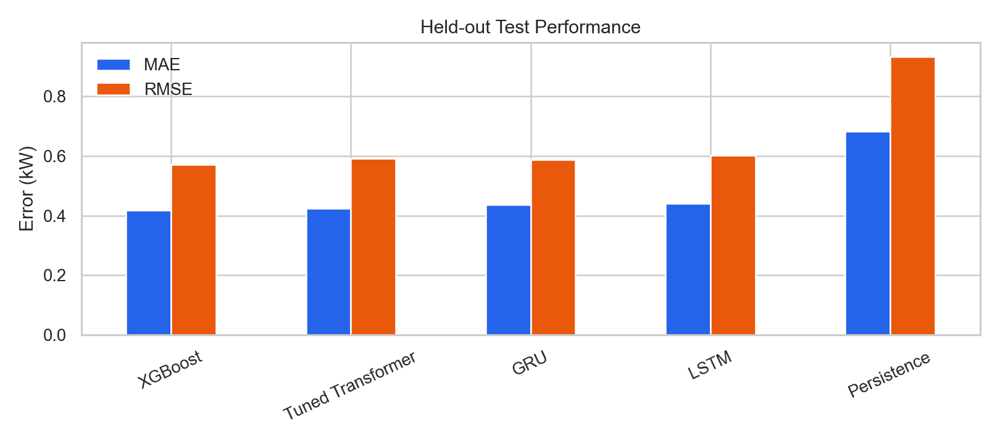
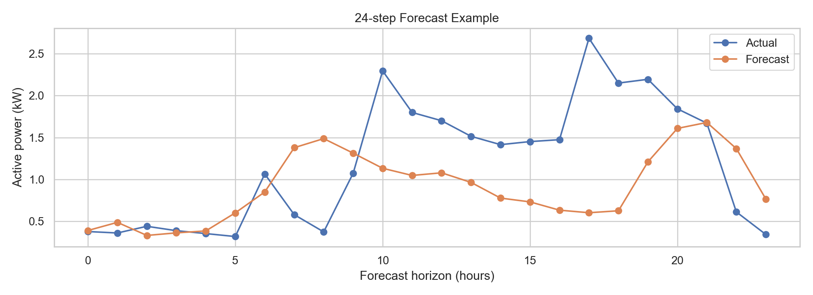
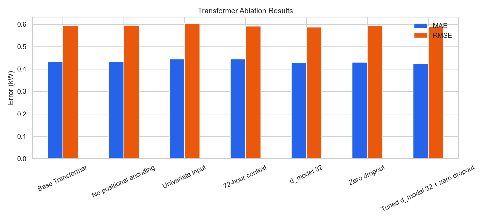

# Transformer-Based Multivariate Electricity Forecasting

An end-to-end, leakage-safe comparison of **Persistence, XGBoost, LSTM, GRU, and a PyTorch Transformer** for direct multi-horizon electricity forecasting.

The project uses the previous 168 hourly observations to forecast the next 24 hours of household active power. It is designed as a reproducible machine-learning study rather than a one-off model demo: chronological splits, train-only scaling, classical and neural baselines, early stopping, multiple metrics, ablations, and saved visual evidence are all included.

## Research question

> Does self-attention improve 24-hour-ahead multivariate electricity forecasting over naive, tree-based, and recurrent baselines—and which design choices account for the difference?

For a prediction origin \(t\), the supervised task is

\[
X_{t-167:t} \in \mathbb{R}^{168 \times F}
\longrightarrow
\hat{y}_{t+1:t+24} \in \mathbb{R}^{24}.
\]

The model predicts all 24 future values directly, avoiding recursive error accumulation.

## Dataset

[UCI Individual Household Electric Power Consumption](https://archive.ics.uci.edu/dataset/235/individual%2Bhousehold%2Belectric%2Bpower%2Bci) contains 2,075,259 minute-level measurements collected in France from December 2006 to November 2010. It is multivariate, includes short missing intervals, and is licensed under CC BY 4.0.

The pipeline aggregates the seven electrical measurements to hourly means, fills only short gaps using past values, and adds cyclic calendar features:

- active and reactive power, voltage, current intensity;
- three sub-metering measurements;
- sine/cosine encodings for hour, day of week, and month.

The target is `global_active_power` in kW. The repository does not commit the raw dataset; the preparation command downloads it from UCI.

## Methodology

Data are divided chronologically into 70% train, 15% validation, and 15% test. There is no random shuffling across time. Feature means and standard deviations are fitted on the training interval only. Validation and test windows may use observations from the immediately preceding interval as context, but every forecast target stays inside its own split.

Models:

1. **Persistence:** repeats the most recently observed load for all 24 steps.
2. **XGBoost:** uses recent target lags plus per-feature mean, standard deviation, and last value; one regressor is fitted per horizon.
3. **LSTM and GRU:** encode the history and directly regress the 24-step vector.
4. **Transformer:** projects multivariate inputs to `d_model`, adds sinusoidal position encodings, applies pre-norm encoder layers, and maps the final encoded token to 24 outputs.

Evaluation uses MAE, RMSE, and MAPE in the original kW scale. Because MAPE is unstable near zero, MAE and RMSE are the primary selection metrics.

## Quick start

Python 3.9+ is required. From the repository root:

```bash
make setup
```

On macOS, XGBoost also needs the OpenMP runtime. If XGBoost reports that
`libomp.dylib` is missing, install it once with `brew install libomp` (after
installing Homebrew). Linux and Windows wheels normally need no extra step.

If OpenMP is installed through Anaconda instead, use the targeted loader below.
Do not add the entire Conda library directory to `DYLD_LIBRARY_PATH`, because
that can make NumPy load incompatible BLAS libraries.

```bash
conda install conda-forge::llvm-openmp
DYLD_INSERT_LIBRARIES="$CONDA_PREFIX/lib/libomp.dylib" \
  .venv/bin/python scripts/train.py --config configs/base.yaml --models xgboost --tag xgboost_real
```

First verify every model on synthetic data (this is only a software check, never a reported experiment):

```bash
make demo
make smoke
```

Then run the real study:

```bash
make data
make eda
make train
```

Reproduce the selected Transformer configuration (`d_model=32`, zero dropout) with:

```bash
make tuned
```

Equivalent commands without `make`:

```bash
python3 -m venv .venv
.venv/bin/python -m pip install -e .
.venv/bin/python scripts/prepare_data.py
.venv/bin/python scripts/run_eda.py
.venv/bin/python scripts/train.py --config configs/base.yaml
```

The first data command downloads about 20 MB and extracts a roughly 127 MB text file.

## Outputs

Each run creates a folder under `artifacts/` containing:

- `metrics.csv` and `metrics.json`;
- `metrics_by_horizon.csv` and a cross-model comparison chart;
- the best neural checkpoint for each model;
- training/validation loss curves;
- an actual-versus-forecast plot for each model.

EDA writes daily patterns, intraday profiles, and a correlation heatmap to `artifacts/eda/`.

## Main results

Results below are from the chronological held-out test set. Errors are reported in the original kW scale.

| Model | MAE | RMSE | MAPE | Training time (s) |
|---|---:|---:|---:|---:|
| **XGBoost** | **0.4183** | **0.5712** | 61.35% | **31.38** |
| Tuned Transformer | 0.4240 | 0.5910 | **56.87%** | 125.71 |
| GRU | 0.4355 | 0.5874 | 63.30% | 342.81 |
| LSTM | 0.4400 | 0.6020 | 62.05% | 61.84 |
| Persistence | 0.6825 | 0.9345 | 98.54% | — |

XGBoost produced the lowest MAE and RMSE while also training fastest, reducing MAE by 38.7% and RMSE by 38.9% relative to Persistence. After tuning, the Transformer came within 1.3% of XGBoost's MAE and achieved the lowest MAPE, but the tree-based model retained a 3.3% RMSE advantage. This is an important negative result: on a moderate-sized structured series, carefully engineered lag and summary features can be more data-efficient than a larger attention model.

MAPE is treated as secondary because household demand sometimes approaches zero, making percentage errors unstable.





### Transformer ablations

| Variant | MAE | RMSE | MAPE | Time (s) |
|---|---:|---:|---:|---:|
| Base (`d_model=64`, dropout 0.10) | 0.4339 | 0.5939 | 60.13% | 175.21 |
| No positional encoding | 0.4337 | 0.5955 | 59.84% | 165.77 |
| Univariate input | 0.4455 | 0.6028 | 65.08% | 283.23 |
| 72-hour context | 0.4457 | 0.5924 | 67.92% | **50.19** |
| `d_model=32` | 0.4296 | **0.5880** | 59.41% | 143.10 |
| Zero dropout | 0.4308 | 0.5933 | 58.40% | 121.14 |
| **Tuned: `d_model=32`, zero dropout** | **0.4240** | 0.5910 | **56.87%** | 125.71 |

The tuned model improved MAE by 2.3% and MAPE by 3.26 percentage points over the base Transformer. Multivariate input mattered more than sinusoidal positional encoding, likely because explicit cyclic calendar features already expose temporal position. The shorter context traded lower compute for worse MAE and MAPE.



## Ablation and hyperparameter experiments

```bash
make experiments
```

This compares the full Transformer with:

- no positional encoding;
- target history only (univariate input);
- a 72-hour instead of 168-hour context;
- `d_model=32` instead of 64;
- zero dropout instead of 0.10.

Each experiment has a separate artifact folder. Compare their `metrics.csv` files. Run the same seed first for a controlled comparison; for a stronger final report, repeat the best configurations with three seeds and report mean ± standard deviation.

## Repository structure

```text
configs/                 experiment configuration
data/raw/                downloaded source data (ignored)
data/processed/          hourly model-ready data (ignored)
scripts/prepare_data.py  download, clean, aggregate, or make demo data
scripts/run_eda.py       descriptive statistics and figures
scripts/train.py         train/evaluate selected models
scripts/run_experiments.py
src/load_forecasting/    reusable data, model, training, and plotting code
artifacts/               generated metrics, checkpoints, and figures (ignored)
```

## Interpreting the results

Do not assume the Transformer must win. A credible report explains *why* a simpler model is competitive if that is what the held-out test shows. Inspect performance by forecast horizon, peak-load periods, weekday/weekend, and season. Discuss compute cost alongside error reduction.

## Evidence-supported CV bullets

- Built a leakage-safe multivariate forecasting pipeline over **2.07M minute-level electricity records**, producing 34,211 hourly observations with electrical and cyclic calendar features for direct 24-hour prediction.
- Implemented and benchmarked **Persistence, XGBoost, LSTM, GRU, and a PyTorch Transformer** using chronological splits and train-only scaling; reduced held-out MAE by **38.7%** and RMSE by **38.9%** over Persistence with XGBoost.
- Developed and tuned an encoder-only Transformer through controlled feature, position-encoding, context-length, embedding-size, and dropout ablations, achieving **0.4240 kW MAE** and **56.87% MAPE** on the held-out test set.

## Reproducibility notes

- Random seeds are fixed in configuration.
- Preprocessing and evaluation are deterministic apart from hardware-specific floating-point behavior.
- Checkpoints and generated data are excluded from Git to keep the repository small.
- Dataset citation: Hebrail, G. & Berard, A. (2006). *Individual Household Electric Power Consumption*. UCI Machine Learning Repository. DOI: 10.24432/C58K54.
